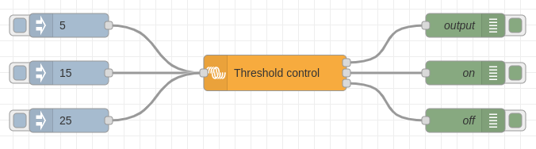

# Threshold control

With the treshold control you can enable or disable a delayed output when the input
passes the on or off threshold.

## Configuration

There are a few values that need configuration before the node can be used:

* **On payload ** - The `msg.payload` to send when the on threshold get passed (and the counter reaches zero).
* **Off payload** - The `msg.payload` to send when the off threshold get passed (and the counter reaches zero).
* **On threshold** - As soon as this threshold gets passed by `msg.payload`, the _onDelay_ counter counts down to zero. If that hass passed, a "on" `msg.payload` gets send to the first output._
* **Off threshold** - As soon as this threshold gets passed by `msg.payload`, the _offDelay_ counter counts down to zero. If that hass passed, a "off" `msg.payload` gets send to the first output.
* **On delay** - the delay in seconds that is waited before the output gets send after the input passes the on threshold.
* **Off delay** - the delay in seconds that is waited before the output gets send after the input passes the off threshold.

The on threshold should be higher than the off threshold.

## Input

By default the node listens to `msg.payload` as input.

It also listens to different messages, which can change the configured values:

* `msg.onThreshold` - The on threshold
* `msg.offThreshold` - The off threshold
* `msg.onDelay` - The on delay in seconds
* `msg.offDelay` - The off delay in seconds

## Outputs

There are three outputs. The first one just gives "on" or "off" (after the
delay has passed).

The second output gives the state of the counter for the on delay.

The third output gives the state of the couter for the off delay.

## Status

The status node tries to show the current state. It can turn red on wrong input
and on the "off" state, green on the "on" state and yellow when the on or off
counter is running.

When you do a fresh deploy and then inject values within the hysteresis region
(between on and off thresholds) the Node status will be displayed as "unknown"
with a blue dot.
